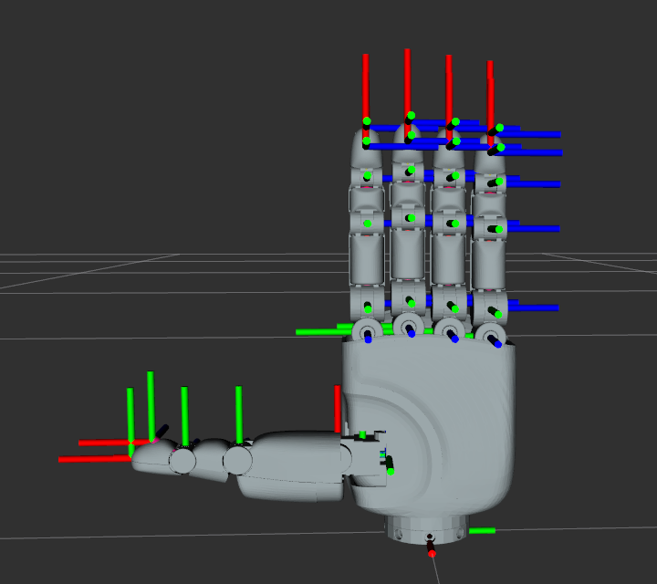
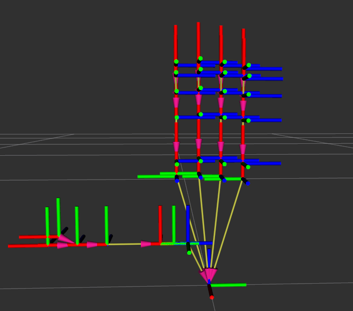
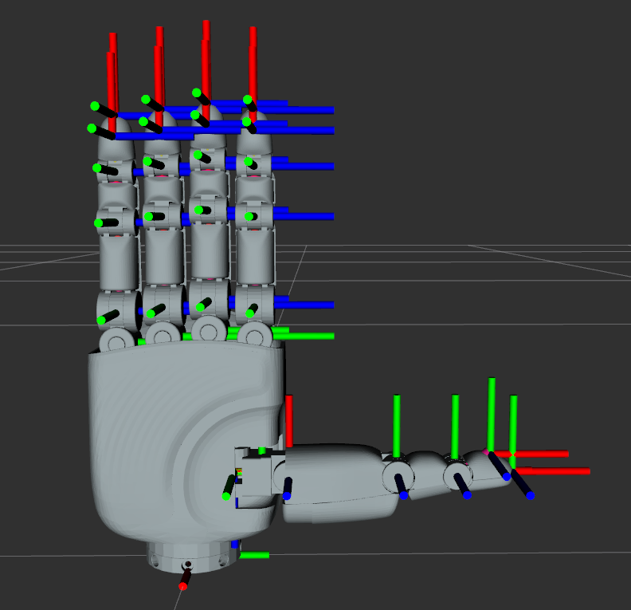
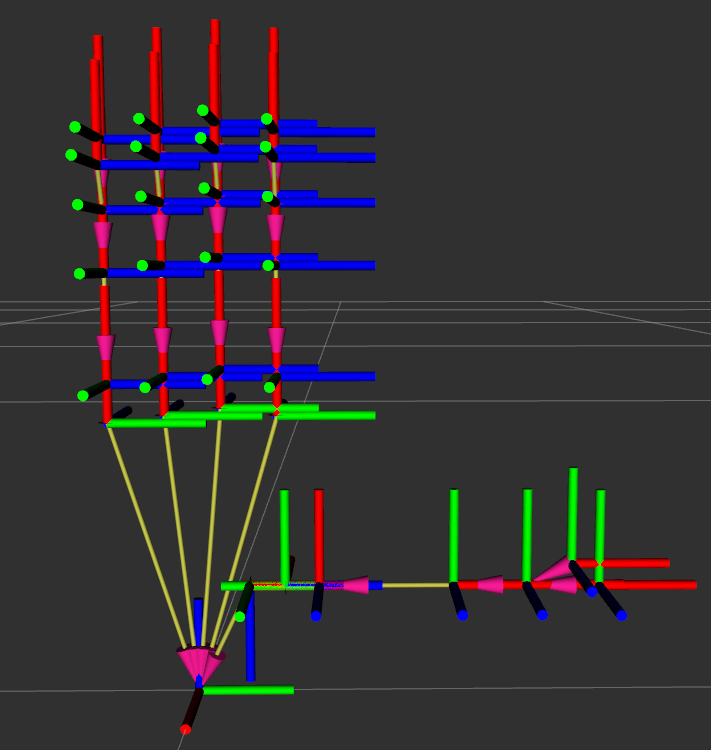

**语言 / Language：** **中文** · [English](README.md)

**版本 / Version：** **0.1.0**（见 [`VERSION`](VERSION)）

> **初步版本说明：** 当前为早期版本，**并非**最终发布版本。URDF、网格与文档在后续版本中可能调整。

## 1.文档说明

此文档描述apexhand灵巧手urdf相关信息。此文档和urdf皆为初步拟定，urdf中动力学参数还未标定完成。如发现有任何错误，可以反馈邮件至：support@dexcelbot.com，我们第一时间处理。

## 2.文件结构

仓库根目录下为 **`apex_hand_left/`**、**`apex_hand_right/`**（左右手 URDF 与网格）、**`images/`**（文档配图）、**`VERSION`**（当前版本号）、**`README.md`**（英文，默认）与 **`README.zh.md`**（本中文说明）。左右手各自为 **URDF + `meshes/`**，与 URDF 中 `./meshes/` 相对路径一致。

```text
apex_hand_urdf/                      # 仓库根目录（克隆后的项目文件夹名以实际为准）
├── apex_hand_left/
│   ├── apex_hand_left.urdf         # 左手 URDF
│   └── meshes/                     # STL 网格（URDF 引用 ./meshes/...）
│       ├── Palm_link_left.STL
│       ├── f0_link0.STL
│       └── ...                     # 各指节、传感器壳体等 STL
├── apex_hand_right/
│   ├── apex_hand_right.urdf        # 右手 URDF
│   └── meshes/
│       ├── Palm_link_right.STL
│       ├── f0_link0.STL
│       └── ...
├── images/                         # README 用图（坐标系示意等）
│   ├── left.png
│   ├── left_skeleton.png
│   ├── right.png
│   └── right_skeleton.png
├── VERSION                         # 当前版本号（0.1.0）
├── README.md                       # 英文说明（默认）
└── README.zh.md                    # 中文说明（本文件）
```

若仅需右手单机资源，可将 **`apex_hand_right/`** 整个文件夹（含 `.urdf` 与 `meshes/`）单独拷贝使用，路径需与 URDF 内 mesh 相对路径保持一致。

## 3.关节说明

#### 3.1由度说明

整手共21个自由度，其中16个主动自由度，5个被动自由度。

#### 3.2关节参数表

| 名称       | 是否耦合 | 耦合关系                   | 范围（角度） | 说明                                       |
| ------------ | ---------- | ---------------------------- | -------------- | -------------------------------------------- |
| f0\_joint0 | 否       | /                          | 0～80        | 近似与人的拇指腕掌关节（cmc）的侧摆        |
| f0\_joint1 | 否       | /                          | -10～60      | 近似与人的拇指腕掌关节（cmc）的内/外旋     |
| f0\_joint2 | 否       | /                          | 0～80        | 近似与人的拇指腕掌关节（cmc）的屈/伸       |
| f0\_joint3 | 否       | /                          | -20～80      | 近似于人的拇指掌指关节（mcp）的屈伸        |
| f0\_joint4 | 是       | 与f0\_joint3耦合，关系1：1 | -20～80      | 近似于人的拇指指间关节（ip）的屈/伸        |
| f1\_joint0 | 否       | /                          | -25～25      | 近似于人的食指掌指关节（mcp）的侧摆        |
| f1\_joint1 | 否       | /                          | -20～90      | 近似于人的食指掌指关节（mcp）的屈/伸       |
| f1\_joint2 | 否       | /                          | -5～100      | 近似于人的食指近端指间关节（pip）的屈/伸   |
| f1\_joint3 | 是       | 与f1\_joint3耦合，关系1：1 | -5～100      | 近似于人的食指远端指间关节（dip）的屈/伸   |
| f2\_joint0 | 否       | /                          | -25～25      | 近似于人的中指掌指关节（mcp）的侧摆        |
| f2\_joint1 | 否       | /                          | -20～90      | 近似于人的中指掌指关节（mcp）的屈/伸       |
| f2\_joint2 | 否       | /                          | -5～100      | 近似于人的中指近端指间关节（pip）的屈/伸   |
| f2\_joint3 | 是       | 与f2\_joint2耦合，关系1：1 | -5～100      | 近似于人的中指远端指间关节（dip）的屈/伸   |
| f3\_joint0 | 否       | /                          | -25～25      | 近似于人的无名指掌指关节（mcp）的侧摆      |
| f3\_joint1 | 否       | /                          | -20～90      | 近似于人的无名指掌指关节（mcp）的屈/伸     |
| f3\_joint2 | 否       | /                          | -5～100      | 近似于人的无名指近端指间关节（pip）的屈/伸 |
| f3\_joint3 | 是       | 与f3\_joint2耦合，关系1：1 | -5～100      | 近似于人的无名指远端指间关节（dip）的屈/伸 |
| f4\_joint0 | 否       | /                          | -25～25      | 近似于人的小指掌指关节（mcp）的侧摆        |
| f4\_joint1 | 否       | /                          | -20～90      | 近似于人的小指掌指关节（mcp）的屈/伸       |
| f4\_joint2 | 否       | /                          | -5～100      | 近似于人的小指近端指间关节（pip）的屈/伸   |
| f4\_joint3 | 是       | 与f4\_joint2耦合，关系1：1 | -5～100      | 近似于人的小指远端指间关节（dip）的屈/伸   |

## 4.坐标系说明

左右手的坐标系均为右手坐标系，法兰处为基坐标系。每根手指在指尖和指腹分别有一个坐标系，命名tip和pad。例如大拇指之间坐标系为：f0\_tip。大拇指指腹坐标系位：f0\_pad。

左手的xi轴方向：zi-1->zi

右手的xi轴方向：zi->zi-1

#### 4.1左手坐标系图





### 4.2右手坐标系图




